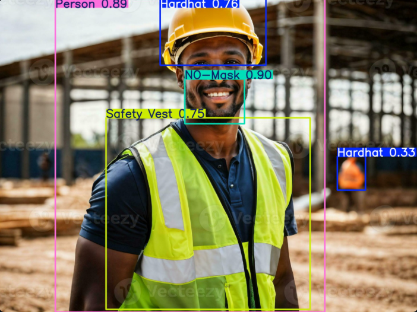

# 🧠 YOLOv8 Object Detection Web App

A web application built using **Streamlit** and **Ultralytics YOLOv8** that allows users to upload an image or video and get real-time object detection results.

---

## 🚀 Features

- 📸 Upload images or videos
- 🧠 Run object detection using YOLOv8
- 🖼️ Display image results inside the web app
- 🎞️ Save detected video locally with a message showing the location
- 🧹 Lightweight, no file permanently stored unless needed

---

## 📂 Project Structure

<pre> <code> yolo_streamlit/ ├── app.py # Main Streamlit app ├── yolov8n.pt # YOLOv8 model (can be replaced with custom one) ├── static/ # Optional output file storage (images/videos) ├── assets/ # Input/output samples for README (optional) └── README.md </code> </pre>
---

## 🧠 Model Used

- **YOLOv8n** (`custom_yolo_model.pt`)
- You can replace with your own custom-trained model from [Ultralytics](https://github.com/ultralytics/ultralytics).

---

## 💻 Installation & Usage

### 1️⃣ Clone the repo

```bash
git clone https://github.com/your-username/yolo-streamlit-app.git
cd yolo-streamlit-app
```

### 2️⃣ Install dependencies

```bash
pip install streamlit ultralytics opencv-python pillow
```

### 3️⃣ Run the Streamlit app

```bash
streamlit run app.py
```
Then open http://localhost:8501 in your browser.

## 📷 Example: Image Detection

**Input Image:**


**Output (Detected):**



---

## 🎥 Example: Video Detection

**Input Video:**

[video.mp4](https://user-images.githubusercontent.com/yourusername/assets/video.mp4)

**Output Image:**

[result_video.avi](https://user-images.githubusercontent.com/yourusername/assets/result_video.avi)

## 🛠️ How it works
Upload a file using the file uploader.

YOLOv8 processes it using model.predict().

**For images:**

Shows the detected result right on the page.

**For videos:**

Saves the result in runs/detect/ and prints the file path.

## ✅ To Do
 Add download button for results

 Auto-clean runs/detect/ folder

 Add Gradio version

 Deploy on Hugging Face Spaces

 ## 🌟 Show your support
 
If you like this project, please ⭐ the repo!
